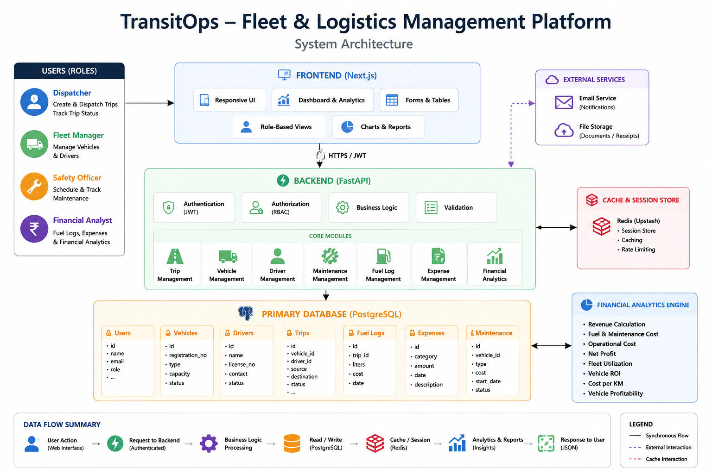

🚚 TransitOps — Enterprise Fleet & Logistics Management Platform

  

---
📖 Project Description
TransitOps is a modern Fleet & Logistics Management Platform built for managing commercial transportation operations.
The platform streamlines the complete logistics lifecycle—from fleet registration and trip dispatching to vehicle maintenance scheduling and financial analytics—through secure Role-Based Access Control (RBAC).
The application enables multiple operational teams to collaborate on a centralized platform while ensuring each user only accesses features relevant to their responsibilities.
---
🚀 Live Demo
Website: Coming Soon
---
🎥 Demo Video
Coming Soon
---
✨ Features
🔐 JWT Authentication & Role-Based Access Control
🚚 Complete Trip Management Workflow
🚛 Vehicle & Driver Registry
📋 Dispatch & Trip Lifecycle Management
🛠 Vehicle Maintenance Scheduling
⛽ Fuel Log Management
💰 Expense Tracking
📊 Financial Analytics Dashboard
📈 Vehicle Profitability & ROI
📉 Fleet Utilization Metrics
📱 Responsive Enterprise Dashboard
---
🏗️ System Architecture

  

The diagram above shows the full request flow — from role-based user actions in the Next.js frontend, through JWT-authenticated FastAPI backend modules, into PostgreSQL for persistence and Redis for caching/session storage, with a dedicated Financial Analytics engine and external services (email/file storage) integrated alongside.
---
⚙️ Workflow
text
User Login
     │
     ▼
JWT Authentication
     │
     ▼
Role Verification (RBAC)
     │
     ├──────────────┬──────────────┬──────────────┐
     ▼              ▼              ▼              ▼

Dispatcher     Fleet Manager  Safety Officer  Financial Analyst

     │              │              │               │

Create Trip    Register Fleet  Schedule       Manage Expenses
Dispatch Trip   Add Drivers     Maintenance    Fuel Logs

     │              │              │               │
     └──────────────┴──────────────┴───────────────┘
                        │
                        ▼
                PostgreSQL Database
                        │
                        ▼
             Financial Analytics Dashboard

👥 User Roles
🚚 Dispatcher
Create Trips
Dispatch Trips
Complete Trips
Cancel Trips
---
🚛 Fleet Manager
Register Vehicles
Register Drivers
Update Fleet Status
Manage Driver Availability
---
🛠 Safety Officer
Schedule Maintenance
Start Maintenance
Complete Maintenance
Monitor Driver Safety
License Expiry Tracking
---
💰 Financial Analyst
Manage Fuel Logs
Record Expenses
Revenue Tracking
Cost Analysis
Fleet Profitability
ROI Analysis
---
📸 Screenshots
Login	Dashboard
Coming Soon	Coming Soon

Dispatcher	Fleet Manager
Coming Soon	Coming Soon

Safety Officer	Financial Dashboard
Coming Soon	Coming Soon
---
📂 Repository Structure
text
TransitOps/
│
├── backend/
│   ├── app/
│   ├── db/
│   ├── routes/
│   ├── alembic/
│   ├── requirements.txt
│   └── main.py
│
├── frontend/
│   ├── src/
│   ├── public/
│   ├── components/
│   └── package.json
│
├── docker-compose.yml
├── README.md
└── .env.example

---
🛠️ Tech Stack
Frontend
Next.js
React
TypeScript
Tailwind CSS
shadcn/ui
Backend
FastAPI
SQLAlchemy
Alembic
Pydantic
JWT Authentication
Database
PostgreSQL
Redis
DevOps
Docker
Git
GitHub
---
🗄️ Database Schema (ER Diagram)
> Add ER Diagram image here
text
Users
 │
 ├── Trips
 │      │
 │      ├── Vehicles
 │      ├── Drivers
 │      ├── Fuel Logs
 │      └── Expenses
 │
 └── Maintenance

---
🔐 Authentication & RBAC
TransitOps uses secure JWT Authentication with Role-Based Access Control.
Supported Roles:
Dispatcher
Fleet Manager
Safety Officer
Financial Analyst
Each role has isolated permissions enforced at the API level.
---
⚡ Backend Features
JWT Authentication
Refresh Tokens
Role-Based Authorization
Trip Lifecycle APIs
Fleet Management APIs
Driver Management APIs
Maintenance APIs
Fuel Log APIs
Expense APIs
Financial Analytics APIs
Alembic Database Migrations
PostgreSQL Integration
---
🎨 Frontend Features
Responsive Dashboard
Secure Login
Dynamic Sidebar
Real-Time Data Tables
Search & Filtering
Status Badges
Analytics Cards
Dialog-Based CRUD Operations
Form Validation
Protected Routes
---
📊 Financial Analytics
The platform provides enterprise-grade financial insights including:
Total Revenue
Fuel Cost
Maintenance Cost
Operational Cost
Net Profit
Fleet Utilization
Vehicle ROI
Cost per Kilometer
Fuel Efficiency
Vehicle Profitability
---
🚀 Installation
Backend Setup
bash
cd backend

python -m venv .venv

source .venv/bin/activate
# Windows
.venv\Scripts\activate

pip install -r requirements.txt

alembic upgrade head

uvicorn app.main:app --reload

Frontend Setup
bash
cd frontend

npm install

npm run dev

Environment Variables
env
DATABASE_URL=

REDIS_URL=

SECRET_KEY=

ALGORITHM=HS256

ACCESS_TOKEN_EXPIRE_MINUTES=30

REFRESH_TOKEN_EXPIRE_DAYS=7

Run with Docker
bash
docker compose up --build

---
📚 API Documentation
After running the backend:
Swagger UI
http://localhost:8000/docs
ReDoc
http://localhost:8000/redoc
---
🚀 Future Improvements
GPS Vehicle Tracking
Live Map Integration
Route Optimization
Driver Mobile App
Push Notifications
AI Demand Forecasting
Predictive Maintenance
IoT Sensor Integration
---
👨‍💻 Team
Mohit Kumar
Sahil
Mohit
Chandrika Pandey
